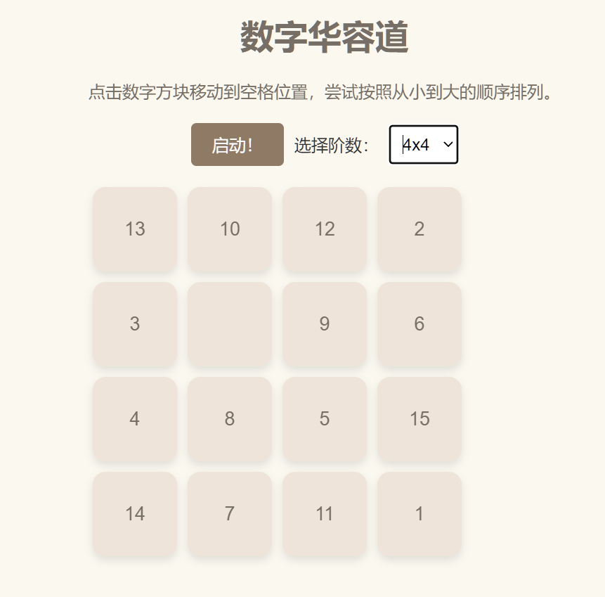
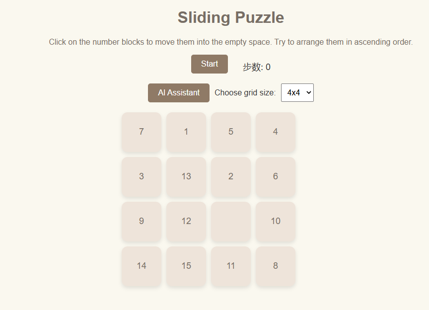

# 数字华容道

数字华容道是一种数字益智游戏，灵感来自于传统的华容道游戏。在这个游戏中，你需要通过移动数字方块的位置，将它们按照升序或特定规则排列起来。这种游戏通常在一个方形的网格上进行，其中包含一个空白位置，你可以利用这个空白位置进行数字方块的移动。

## 基本规则

- 游戏板上有一个空白位置和一些数字方块，初始状态下数字方块的顺序是随机的。
- 你可以通过将数字方块沿着水平或垂直方向上的空白位置移动来进行游戏。
- 目标是通过移动数字方块，最终将它们按照从小到大（或者按照特定规则）的顺序排列起来。
- 通常，游戏会记录你完成游戏所用的移动步数，挑战玩家在尽可能少的步数内完成。

数字华容道既可以是纸质版的物理游戏，也可以是数字版的电子游戏，可以在计算机、手机或平板上进行。这类游戏对于培养逻辑思维和解决问题的能力具有一定的促进作用。

## 代码实现

- `index.js` 包含了代码逻辑实现。
- `top2.js` 包含了前几行排序的实现，通过目标搜索硬排序。
- `bottomTwoStep.js` 包含了最后两行的实现，使用了A*搜索找到局部最优解。逻辑与前几行不同。

# Sliding Puzzle (Huarong Dao)
The sliding puzzle is a number-based puzzle game, inspired by the traditional Huarong Dao game. In this game, you need to rearrange number blocks by moving them into the correct order, either in ascending sequence or according to specific rules. The game is typically played on a square grid, where there is one blank space that you can use to move the number blocks around.

##Basic Rules
- The game board has a blank space and several number blocks, which start in a random order.
- You can move the number blocks horizontally or vertically into the blank space to make moves.
- The goal is to rearrange the blocks by moving them into the correct order, either from smallest to largest or - following certain specific rules.
- Typically, the game tracks the number of moves you make, and the challenge is to complete the puzzle in as few moves as possible.
- The sliding puzzle can exist both as a physical game in print or as a digital game, playable on computers, phones, or tablets. This kind of game helps develop logical thinking and problem-solving skills.

## Code Implementation
- `index.js` contains the main logic implementation.
- `top2.js` handles the sorting of the first few rows using goal search and hard sorting.
- `bottomTwoStep.js` implements the logic for the last two rows, using the A* search algorithm to find the locally optimal solution. The logic here differs from the earlier rows.

